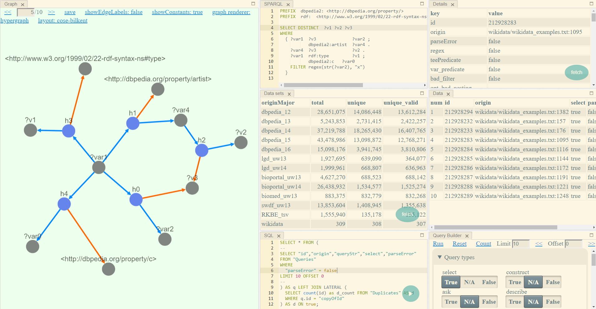

# DARQL

DARQL - Deep Analysis of SPARQL Queries

A large-scale study using the code from this repository has been performed, more details can be found [here](http://www.vldb.org/pvldb/vol11/p149-bonifati.pdf).

You can use the software to either

1. Explore the SPARQL query logs as described [here](#analysis).
2. Reproduce published results as described [here](#analysis).



# Prerequisites

To run DARQL, the following requirements must be met:

1. Java JDK 8
2. Maven build tool
3. PostreSQL (recommended via Docker) for exploration
4. GNU make (optional)

There are also some additional scripts that are written in other languages such as bash and Python3.
The software was developed and executed on Ubuntu 16.04 LTS.
To execute the software, the easiest way is to stay close to this system setup,
for example by using a VM or container like Docker with the same environment.
It is possible to run in other environments, but it has to be set up.
Here are some instructions to help with this.

## Linux

To install the requirements on a Debian-based distro such as Ubuntu:

```bash
sudo apt-get install docker.io
```

For a newer version of Docker follow [instructions on their site](https://docs.docker.com/install/linux/docker-ce/debian/).

To install Java and Maven with [SDKMAN](https://github.com/sdkman/sdkman-cli):

```bash
curl -s "https://get.sdkman.io" | bash
sdk install java 8.0.201-zulu
sdk install maven
```

## macOS

To easily install the requirements with [Homebrew](https://brew.sh/index_de.html):

```bash
brew install docker
brew install make
```

To install Java and Maven with [SDKMAN](https://github.com/sdkman/sdkman-cli):

```bash
curl -s "https://get.sdkman.io" | bash
sdk install java 8u161-oracle
sdk install maven
```

## Windows

To easily install the requirements with [Chocolatey](https://chocolatey.org/):

```ps1
cinst -y docker
cinst -y jdk8
cinst -y maven

cinst -y msys2
msys2
pacman -Sy make
```

Alternatively, you can use [WSL on Windows 10](https://docs.microsoft.com/en-us/windows/wsl/install-win10) and follow the instructions for Linux.
Because Java can run natively on Windows, you could use the software natively as well,
but the included scripts to make running easier are designed for a Unix environment.
Another alternative to achieve this is to simply use a VM.

# Usage

## Exploration
<a name="exploration"></a>

If `make` is installed, predefined targets can be used:

1. Clone the repository and `cd` into it. Set `Makefile=src/main/resources/sample/demo/demo.mk`.
2. Run `make -f $Makefile pg_start` to start PostgreSQL via Docker.
3. Run `make -f $Makefile db` to populate the database with [examples](src/main/resources/sample/demo/wikidata.txt).
4. Run `make -f $Makefile web` to start the server.
5. Open [http://localhost:8888](http://localhost:8888) in a browser.

Alternatively, look in the `Makefile` to run the steps manually or to adjust them.
For example, PostgreSQL can be without Docker, but then it has to be set up.

By default, the target will set up and populate the database with data from [Wikidata](src/main/resources/sample/demo/wikidata.txt).
To make changes and supply different data with other formats, adjust or create a new configuration file `config.yaml` as supplied in the `Makefile`.

When finished, you can stop the server from the command line and then shutdown PostgreSQL with `make pg_stop`.

## Analysis and Reproduction
<a name="analysis"></a>

A full analysis on prepared data sets can be performed and aggregated results will be output.
This yields fully reproducible results for all analyses.

1. Clone the repository and `cd` into it. Then `export PRIME_DIR=.`.
2. For [logs from Wikidata](https://iccl.inf.tu-dresden.de/web/Wikidata_SPARQL_Logs/en),
run `bash scripts/batch/prepare_wikidata.sh` to prepare the data for input.
3. By default, the previous step will also run the full analysis after preparations are complete.
The script for the full analysis `scripts/batch/batch_wikidata.sh` can also be invoked manually.
4. A timestamped spreadsheet with results will be output to `out/xlsx` by default.
Additional output can be found in a timestamped subdirectory for each run in `out/batch`.

## Troubleshooting

Keep in mind that the scripts are a best effort to perform everything automatically.
The scripts are designed to be flexible for different configurations and manual adjustments may be required.
Some important points are:

1. The data sets and intermediate output requires several hundreds of gigabytes of storage.
2. A large amount of RAM should be used to process data, especially for deduplication.
At least 64GB or better 128GB should be used.
To override the RAM allocated to the JVM, as an example,
`export MAVEN_OPTS=-Xms32g -Xmx32g` to try to only use 32GB of RAM.
3. If there are problems, check if all tools used by scripts.
Keep in mind, different version (either outdated or much newer versions) of `bash` and Python could break scripts.
Check the scripts that are run and modify them as needed.
